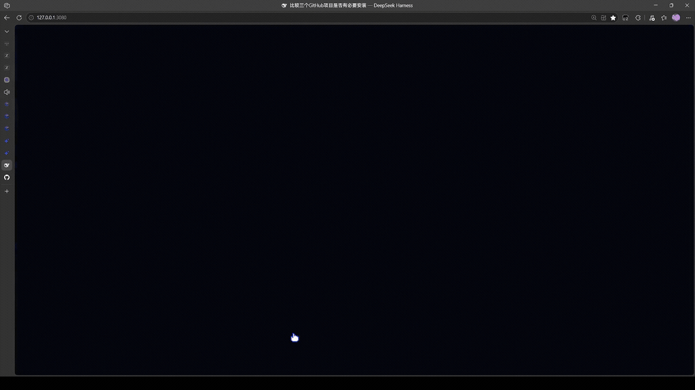
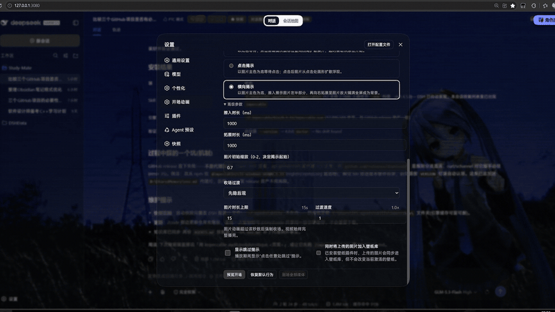
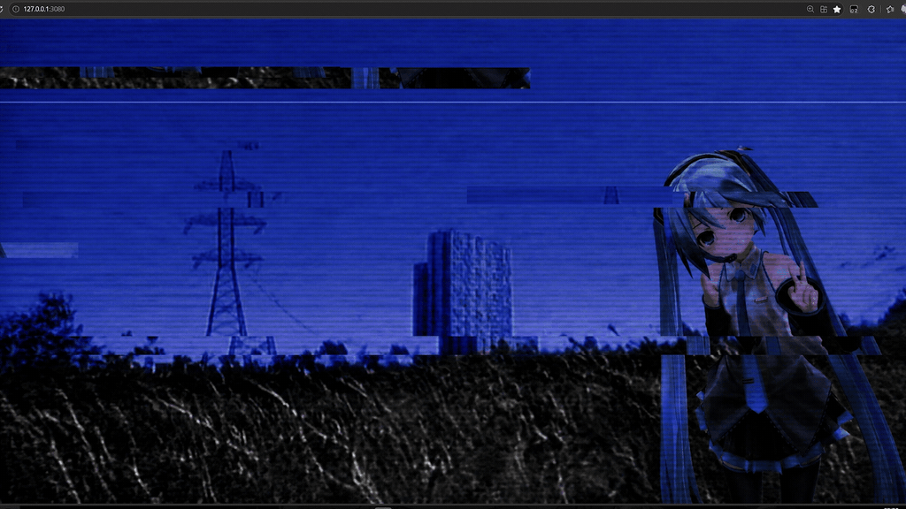
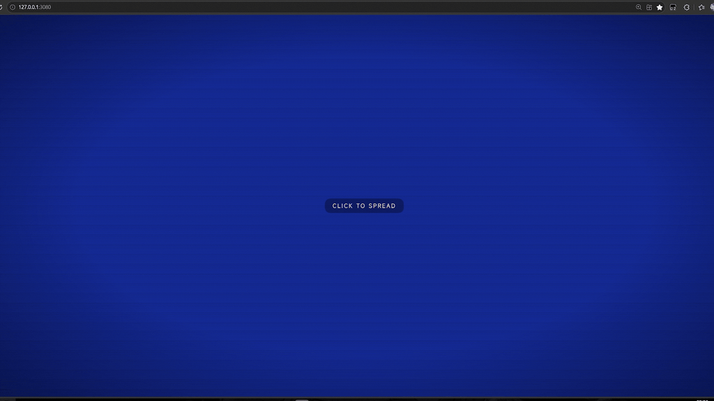
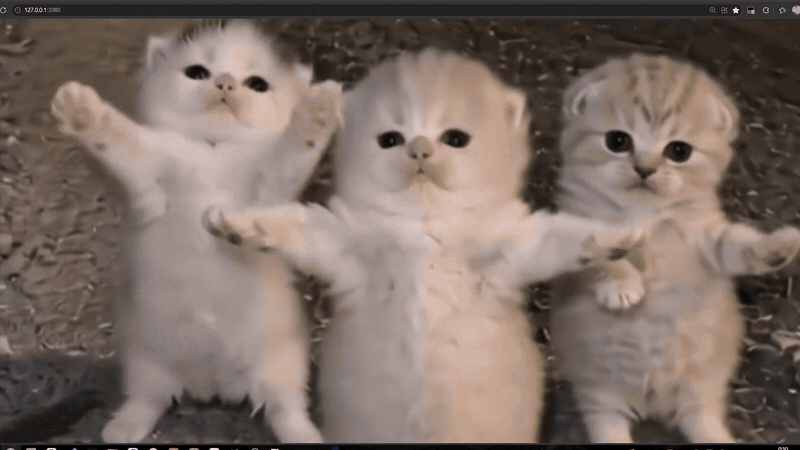

# dsh-opening-animation

[中文](README.md)

An opening-animation plugin for DeepSeek Harness Web: every time a dsh web page loads, a fullscreen overlay plays the opening content you picked — an image animation or a video — then a configurable transition hands the screen back to the UI. Structurally identical to [dsh-custom-skin](https://github.com/SLin-code/dsh-custom-skin) and can run alongside it.

## Features

- **Image openings** (jpg/png/webp/gif/avif, ≤20 MB, library cap of 8 items):
  - `tap-reveal` (default): waits on the picture's dominant color until you click; the picture then blooms out of the click point as an expanding circle (a redo of the former grid reveal, animated after material-vcard; the first click always starts the reveal — only Esc skips; reveal duration adjustable, 0.9 s by default)
  - `wipe-reveal`: on the dominant-color backdrop the picture sits at an initial scale s (0–2, default 1.3); its left edge is placed by the |1-s| ratio rule (distance to the left border vs. to the right border), the screen wipes across the picture from its left edge to its right edge, then the picture lands and eases back to full-screen cover as the backdrop (ported from the GSAP ScrollTrigger image-reveal example)
  - `glitch`: a "Monoclonal Ghost" cinematic opening — the picture fills the screen while the camera pushes in slowly (Ken-Burns zoom 1.02→1.08 with a slight rightward drift) over a graded base of cooled blues, a warm window glow, darkened corners and an adjustable dark veil (0–1, default 0.3); drifting dust, film grain and edge RGB fringe pulses play on top; at random intervals (1.5–3 s) a 100–180 ms VHS burst fires — the frame is cut into 8 horizontal bands, a random 3–5 of them shoved sideways by ±6–30 px while the rest stay in place, and everything resets the moment the burst ends — while a caption in the lower left lights up word by word, karaoke style (`[bracketed]` words are highlights; text and font adjustable); freezes on the clean frame after 20 s by default
  - `grid-reveal-spread`: waits on a backdrop (the picture's dominant color by default, or a fixed color); after a click the picture spreads outward from the pointer position; on timeout (5 s by default) it starts by itself from the last pointer position (or the screen center if there is none)
  - `code-rain`: the picture covers the screen from the first frame while green code rain falls column by column and rolls out through the bottom (column count defaults to 40, duration to 6 s; both adjustable); every column is one pre-rendered rigid stream sprite (translated per frame, never flickers); once the last stream sweeps off-screen the run settles for a 400 ms margin, then freezes clean
  - `retro-boot`: a ten-second retro pixel boot sequence (1920×1080 design coordinates letterboxed, duration adjustable 5–120 s) — the whale logo glows awake over your dimmed picture, #5B6EE8 pixel blocks devour the screen from the edges toward the center, a green nested-rectangle tunnel expands outward, the run settles on pure blue-violet with the whale+wordmark logo under a white glow, a cross/box halftone grid sweeps in from the top-right and turns red as it shrinks, and the ending sits on your picture under an adjustable dark veil (default 0.65) with two dark-red grid sheets; both logos are embedded assets (logo2's white ground was keyed out at generation time), the pixel growth is seed-driven (default 20261009, reproducible from the settings)
- Every image animation above ends with the configurable hand-off transition below — the overlay fades out and the UI (components) fade in; dominant-color extraction skips near-black/near-white pixels so dark wallpapers still yield a vivid color
- **Video openings** (mp4/webm/mkv, ≤256 MB, decode support probed at import): muted autoplay, the transition runs when the video ends, long videos are never cut off; fit (fill screen cover / show full frame contain, default cover) plus scale and horizontal/vertical offsets are adjustable (scale defaults to 1 = no zoom, offsets to 0 = centered, in percent of the screen width/height)
- **Hand-off transitions**: cross-fade (default) / dip-to-bg / zoom-fade, speed adjustable (0.5–2×); while an animation plays the overlay holds the UI down (`#root` is pinned by a pending attribute so no frame flashes), and is restored once the transition ends
- **Skip anytime**: click anywhere or press Esc (the skip hint in the lower right can be turned off)
- **Settings page** (Personalization › Opening animation): upload/pick/remove/clear media, switch animation and transition, adjust advanced parameters, preview, restore defaults; startup playback is off by default and must be enabled in the settings
- **Guardrails & fail-open**: the UI can never be trapped. Fatal engine errors (storage unavailable, media missing, image failing to load, …) tear the overlay down immediately without a transition; three watchdogs — the 8 s load timeout (lifted once the engine reports readiness), the image time limit (default 15 s, adjustable 3–120 s: a forced hand-off insurance only, it never sets the playback length, which comes from each animation's own parameters; videos are exempt) and the 10 s video-stall check — hand the screen back with a transition. Preview ignores the once-per-page-load guard and plays even under prefers-reduced-motion (the unattended startup playback still honors it)
- **dsh-custom-skin handoff** (off by default): when enabled, uploaded images are copied into the wallpaper library as well — one-way, and never changes the skin's preferences

### Image opening animations

**tap-reveal**



**wipe-reveal**



**glitch**



**grid-reveal-spread**



**retro-boot**

A standalone visual prototype (single file, embedded assets, supports `?t=<seconds>` to freeze one frame): [docs/retro-boot.html](docs/retro-boot.html)

### Video opening



## Build

Requires Node ^22.19.0 or ≥24:

```sh
pnpm install
pnpm check   # typecheck + vitest + build
```

## Install into a dsh web profile

```sh
cd $DSH_HOME/profiles/web
pnpm add <path to this directory or a tarball>
# then add "dsh-opening-animation" to the dsh.profile.bundles array
# in the profile's package.json
```

## Adding a new animation

A new animation = one engine file + one registration line in `registry.ts`; parameters declared via `paramsSchema` are rendered by the settings page automatically, with zero changes to the playback path (ADR-003).

## License

MIT
