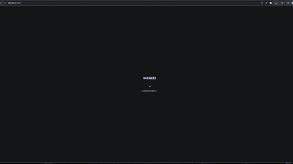
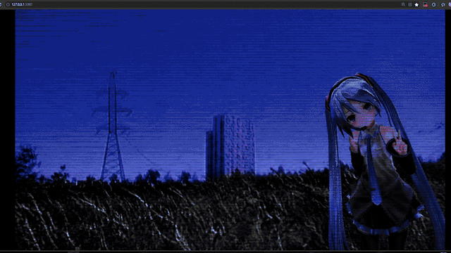
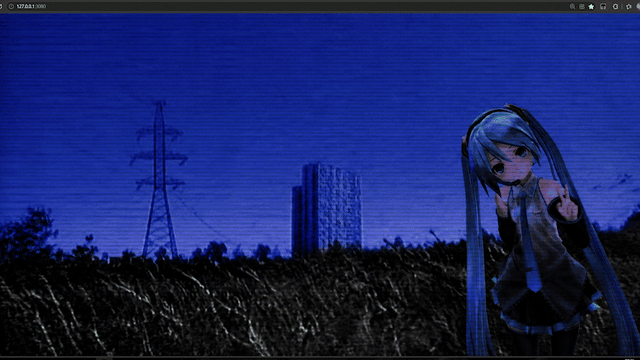

# dsh-opening-animation

[English](README.en.md)

DeepSeek Harness Web 的开场动画插件：每次 dsh web 页面加载时，在全屏遮罩上播放你选择的开场内容——图片动画或视频——结束后以可配置的过渡效果把画面交还主界面。形态与 [dsh-custom-skin](https://github.com/SLin-code/dsh-custom-skin) 完全同构，可与其同场运行。

## 功能

- **图片开场**（jpg/png/webp/gif/avif，≤20 MB，库上限 8 条）：
  - `tap-reveal`：以图片主色为底等待点击，点击处圆形扩散揭示图片（重做的原网格揭示，动画参考 material-vcard；第一击总是开始揭示，Esc 才是跳过；揭示时长可调，默认 0.9s）
  - `wipe-reveal`：主色底上，图片以初始缩放 s（0–2，默认 1.3）静置，其左边缘位置由 |1-s| 比式决定（左边缘到左边框/到右边框距离比），画面从图片左边缘揭示到右边缘；随后图片落位放大回正常大小铺满全屏成为背景（移植自 GSAP ScrollTrigger 图片揭示示例）
  - `pool`：图片静止铺满如池面——指针划过处留下折射水波与粼光（指针注入压力源的波场模拟：涟漪扩散衰减、按波高梯度折射采样背景并加高光；水波强度 0–3 可调，0 关闭）；其上尘埃漂浮、胶片颗粒、边缘 RGB 色散脉冲与左下卡拉OK字幕（`[方括号]` 词为强调词，文本与字体可调）；默认 20s 后定格
  - `grid-reveal-spread`：以底色（默认图片主色，可选固定色）等待，点击后画面从鼠标位置向四周扩散展开；超时（默认 5s）自动从最后指针位置（无指针则屏幕中心）开始
  - `code-rain`：图片铺满开场，绿色代码雨逐列落下、经屏幕底部滚出（列数默认 40、时长默认 6s 可调）；每列是一条预渲染的刚体雨丝（逐帧只平移、不闪烁），最后一条雨丝扫出屏幕、留 400ms 缓冲后干净定格
  - `retro-boot`：十秒复古像素开机序列（1920×1080 设计坐标 letterbox，时长 5–120s 可调）——鲸鱼 Logo 在暗化的图片背景上亮起呼吸，#5B6EE8 大像素方块从四周向中心吞噬全屏，绿色嵌套矩形隧道由内向外扩张，定格为纯蓝底鲸鱼+字标（白色外发光），十字/回形半调网格从右上蔓延转红后收缩，结尾以用户图片加可调暗化遮罩（默认 0.65）为底、两片暗红网格定格；两张 Logo 为引擎内嵌素材（logo2 白底已在生成期键出），像素生长由种子驱动（默认 20261009，可在设置中复现）
- 以上图片动画结束时都会走下方可配置的收场过渡——遮罩淡出、主界面（组件）浮现；主色提取会跳过近黑/近白像素，深色壁纸也能取到鲜明主色
- **视频开场**（mp4/webm/mkv，≤256 MB，导入时探测解码支持）：静音自动播放，播完收场，长视频不截断；填充方式（铺满 cover / 完整显示 contain，默认 cover）与缩放、水平/垂直偏移可调（缩放默认 1 不缩放，水平/垂直偏移默认 0 居中，单位为屏幕宽/高的百分比）
- **收场过渡**：cross-fade（默认）/ dip-to-bg / zoom-fade，速度可调（0.5–2×）；动画期间主界面被遮罩按住（`#root` 由 pending 属性压住不闪帧），过渡结束后还原
- **随时跳过**：点击任意处或 Esc（右下角跳过提示可关）
- **设置页**（个性化 › 开场动画）：上传/选择/删除/清空媒体、切换动画与过渡、调整高级参数、预览、恢复默认行为；启动播放默认关闭，需在设置中开启
- **保险与 fail-open**：主界面永远可用。引擎致命错误（存储打不开、媒体缺失、图片加载失败等）立即无过渡撤除遮罩；三道看门狗——加载超时 8s（引擎上报媒体就绪后即解除）、图片超过时长上限（默认 15s、可调 3–120s：仅是强制收场保险，不决定播放时长，实际时长由动画自身参数决定；视频不受限）、视频无进度 10s——触发时带过渡收场。预览不受「每次页面加载只播一次」限制，且忽略系统 reduced-motion（启动自动播放仍尊重）
- **与 dsh-custom-skin 联动**（默认关闭）：开启后上传的图片可同步复制进壁纸库，单向、不改皮肤偏好

### 图片开场动画

**tap-reveal**


**wipe-reveal**


**pool**



**grid-reveal-spread**


**retro-boot**



**code-rain**



独立可视化原型（单文件、内嵌素材、支持 `?t=<秒>` 冻结单帧）：[docs/retro-boot.html](docs/retro-boot.html)

### 视频开场动画


## 构建

需要 Node ^22.19.0 或 ≥24：

```sh
pnpm install
pnpm check   # typecheck + vitest + build
```

## 安装到 dsh web profile

```sh
cd $DSH_HOME/profiles/web
pnpm add <本目录路径或 tarball>
# 然后在 profile package.json 的 dsh.profile.bundles 数组中加入 "dsh-opening-animation"
```

## 加一个新动画

新动画 = 一个引擎文件 + `registry.ts` 里一行注册；参数经 `paramsSchema` 声明后设置页自动渲染，播放链路零改动（ADR-003）。

## License

MIT
