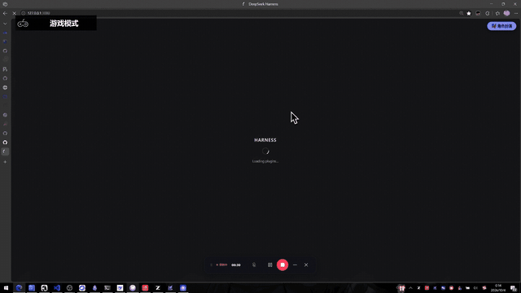
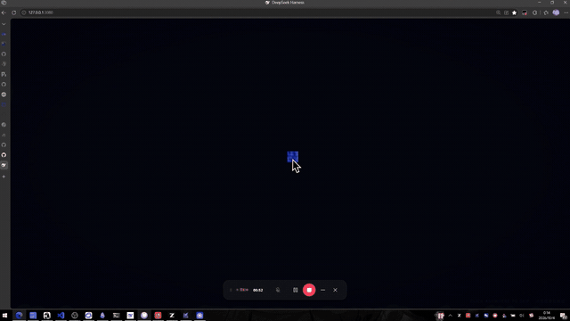
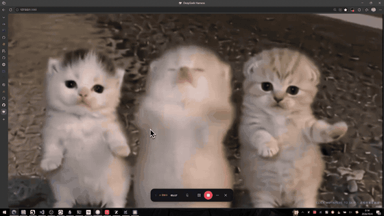

# dsh-opening-animation

DeepSeek Harness Web 的开场动画插件：每次 dsh web 页面加载时，在全屏遮罩上播放你选择的开场内容——图片动画或视频——结束后以可配置的过渡效果把画面交还主界面。形态与 [dsh-custom-skin](https://github.com/SLin-code/dsh-custom-skin) 完全同构，可与其同场运行。

## 功能

- **图片开场**（jpg/png/webp/gif/avif，≤20 MB，库上限 8 条）：
  - `tap-reveal`：以图片主色为底等待点击，点击处圆形扩散揭示图片（重做的原网格揭示，动画参考 material-vcard；第一击总是开始揭示，Esc 才是跳过）
  - `wipe-reveal`：主色底上，图片以初始缩放 s（0–2）静置，其左边缘位置由 |1-s| 比式决定（左边缘到左边框/到右边框距离比），画面从图片左边缘揭示到右边缘；随后图片落位放大回正常大小铺满全屏成为背景（移植自 GSAP ScrollTrigger 图片揭示示例）
  - `glitch`：图片铺满全屏，随机位置爆发故障效果（条带错位 / RGB 通道分离 / 随机块搬移 / 扫描亮线），持续时长与强度可调，时间到定格清晰画面（移植自 glitch-effect）
  - `grid-reveal-spread`：以底色（默认图片主色，可选固定色）等待，点击后画面从鼠标位置向四周扩散展开，超时自动从原位开始
- 以上图片动画结束时都会走下方可配置的收场过渡——遮罩淡出、主界面（组件）浮现；主色提取会跳过近黑/近白像素，深色壁纸也能取到鲜明主色
- **视频开场**（mp4/webm/mkv，≤256 MB，导入时探测解码支持）：静音自动播放，播完收场；长视频不截断；缩放与位置可调（数值参数：缩放默认 1 不缩放，水平/垂直偏移默认 0 居中，单位为屏幕宽/高的百分比）
- **收场过渡**：cross-fade / dip-to-bg / zoom-fade，速度可调；动画期间主界面被遮罩按住（`#root` 由 pending 属性压住不闪帧），过渡结束后还原
- **随时跳过**：点击任意处或 Esc
- **设置页**（个性化 › 开场动画）：上传/选择/删除/清空媒体、切换动画与过渡、调整高级参数、预览、恢复默认
- **fail-open**：任何失败（存储打不开、媒体缺失、解码失败、加载超时 8s、图片时长上限、视频无进度 10s）都立即无过渡撤除遮罩，主界面永远可用
- **与 dsh-custom-skin 联动**（默认关闭）：开启后上传的图片可同步复制进壁纸库，单向、不改皮肤偏好

### 图片开场动画





### 视频开场动画



## 构建

```sh
pnpm install
pnpm check   # typecheck + vitest + build
```

## 安装到 dsh web profile

```sh
cd $DSH_HOME/profiles/web
pnpm add <本目录路径或 tarball>
# 然后在 profile package.json 的 dsh.profile.bundles 数组中加入 "dsh-opening-animation"
```

## 加一个新动画

新动画 = 一个引擎文件 + `registry.ts` 里一行注册；参数经 `paramsSchema` 声明后设置页自动渲染，播放链路零改动（ADR-003）。

## License

MIT
